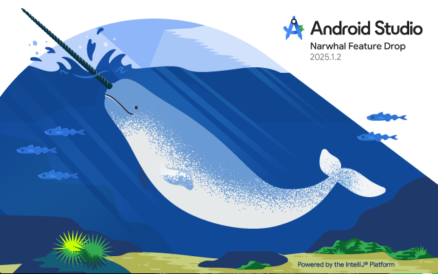

# 🥋 JIU JITSU Project


</br>

## :eyes: 환경 세팅

- Android Studio Narwhal Feature Drop | 2025.1.2 Patch 2 </br>
</br></br>

- AGP : 8.12</br>

</br>

## :open_file_folder: 프로젝트 구조 

- Clean Architecture</br></br>
**기능 단위(Feature-based)**로 디렉토리를 나누고,</br>
**비즈니스 로직과 프레젠테이션(UI)**를 계층적으로 분리해서</br>
협업과 확장에 최적화된 아키텍처입니다.</br></br>
```bash
src/
├── app/                    # 앱 전역 설정 (navigation, theme 등)
├── features/               # 기능별 폴더 구조 
│   ├── feature_1/
│   │     ├── screens/      # 화면 단위 
│   │     ├── components/   # 해당 feature에서만 사용하는 UI 컴포넌트
│   │     ├── services/     # API 통신, 비즈니스 로직
│   │     └── store/        # feature-local 상태관리 (slice 또는 zustand)
│   ├── feature_2/
│   │   ...
│   └── feature_3/
├── shared/                 # 모든 feature에서 공통 
│   ├── components/         # 공통 UI
│   ├── hooks/              # 공통 Hook
│   └── utils/              # 공통 
├── navigation/             # react-navigation 설정
├── store/                  # 전역 상태관리 store
└── index.tsx               # 앱 진입
```

</br>
