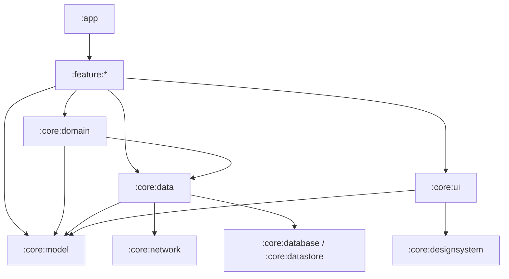

# Architecture

## Architectural Direction

The project targets the current **Now in Android (NIA)** style: official Android layered architecture, reactive data flow, unidirectional UI state, and explicit multi-module boundaries. It is not a strict Clean Architecture or ports-and-adapters implementation.

The data layer is the source of truth for application data. UI events flow downward through ViewModels, UseCases, and repositories. App-model data flows upward through observable streams or stable operation results.

## Current Modules

| Module | Current responsibility |
| --- | --- |
| `:app` | Application entry point, `MainActivity`, app-level navigation, splash flow, Firebase Messaging |
| `:core:ui` | Theme, reusable Compose components, visual mappings, centralized route definitions |
| `:core:data` | Retrofit services, DTOs, app models, repositories, mapping, secure preferences, network/Hilt setup |
| `:core:domain` | UseCases and domain-level orchestration |
| `:feature:login` | Social login UI and signup agreement flow |
| `:feature:nickname` | Nickname validation, duplication check, signup completion |
| `:feature:profile` | Community-profile display and editing |
| `build-logic` | Shared Gradle convention plugins |

Current module declarations are in [`settings.gradle.kts`](../../settings.gradle.kts).

## Current Runtime Shape

```text
App / Compose Screen
-> Hilt ViewModel
-> UseCase
-> Repository
-> Retrofit service or SecurePreferences
```

This flow is transitional. Simple reads, writes, toggles, and events do not require a pass-through UseCase; a feature ViewModel may call a repository contract directly. UseCases are for reusable composition, validation, transformation, or meaningful business operations.

## Target Dependency Shape



`:core:domain -> :core:data` is intentional. The important restriction is that domain and UI layers see repository contracts and stable app models, not DTOs, storage implementations, network modules, or repository implementations.

## Target Modules

- `:core:model`: framework-independent application models shared across layers.
- `:core:designsystem`: theme, typography, icons, and generic Compose primitives.
- `:core:network`: Retrofit/OkHttp configuration, services, and network DTOs when the data layer warrants a separate module.
- `:core:datastore` and optionally `:core:database`: persistence implementations when their size and reuse justify separate modules.

These modules are introduced incrementally. Do not create every NIA module merely to copy the sample project's module count.

## Known Transitional Exceptions

- `:core:domain` currently imports DTO mappers, `UiState`, DataStore types, and `NetworkModule`.
- `:core:ui` currently depends on `:core:data` for model enums used by visual mappings.
- Feature modules currently import DTOs, data-layer `UiState`, and `ProfileSingleton`.
- Repository contracts currently expose response DTOs and `ApiResult`.
- App-wide models currently live under `core:data/model`.
- Route definitions are centralized in `:core:ui`.

Do not add new instances of these patterns. Their removal is tracked in [the NIA architecture migration](../workstreams/nia-architecture-migration.md).

## Detailed References

- [Module boundaries](module-boundaries.md)
- [API and storage contracts](contracts.md)
- [Architecture decisions](decisions/index.md)
- [Development and verification](../development/index.md)

