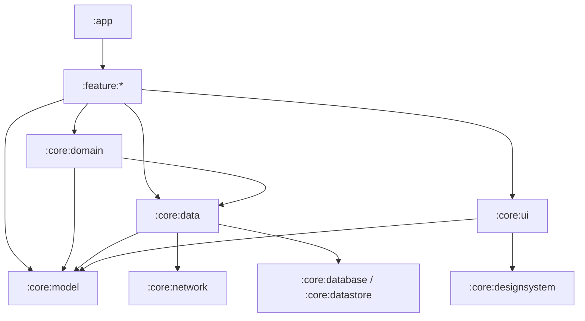

# Architecture

## Architectural Direction

The project targets the current **Now in Android (NIA)** style: official Android layered architecture, reactive data flow, unidirectional UI state, and explicit multi-module boundaries. It is not a strict Clean Architecture or ports-and-adapters implementation.

The data layer is the source of truth for application data. UI events flow downward through ViewModels, UseCases, and repositories. App-model data flows upward through observable streams or stable operation results.

## Current Modules

| Module | Current responsibility |
| --- | --- |
| `:app` | Application entry point, `MainActivity`, app-level navigation, splash flow, Firebase Messaging |
| `:core:model` | Framework-independent application models, commands, and stable operation results |
| `:core:ui` | Theme, reusable Compose components, shared async UI state, visual mappings, centralized route definitions |
| `:core:data` | Repository APIs/implementations, Retrofit services, DTO mapping, session state, secure preferences, network/Hilt setup |
| `:core:domain` | Framework-independent validation and reusable business transformations |
| `:core:webview` | Shared WebView runtime, URL policy, bridge contracts, document lifecycle |
| `:feature:web` | Web screen stack, auth orchestration, native dialog/sheet/chooser/share |
| `:feature:login` | Social login UI and signup agreement flow |
| `:feature:nickname` | Nickname validation, duplication check, signup completion |
| `:feature:profile` | Community-profile display and editing |
| `build-logic` | Shared Gradle convention plugins |

Current module declarations are in [`settings.gradle.kts`](../../settings.gradle.kts).

## Current Runtime Shape

```text
App / Compose Screen
-> Hilt ViewModel
-> Repository contract
-> Retrofit service or repository-owned StateFlow / SessionRepository
```

Simple reads, writes, toggles, and events use repositories directly. A future UseCase is justified only when it provides reusable composition, validation, transformation, or a meaningful business operation.

## Target Dependency Shape



`:core:domain -> :core:data` is intentional. The important restriction is that domain and UI layers see repository contracts and stable app models, not DTOs, storage implementations, network modules, or repository implementations.

## Target Modules

- `:core:model`: framework-independent application models shared across layers.
- `:core:designsystem`: theme, typography, icons, and generic Compose primitives.
- `:core:network`: Retrofit/OkHttp configuration, services, and network DTOs when the data layer warrants a separate module.
- `:core:datastore` and optionally `:core:database`: persistence implementations when their size and reuse justify separate modules.

These modules are introduced incrementally. Do not create every NIA module merely to copy the sample project's module count.

## Remaining Transitional Work

- Route definitions are still centralized in `:core:ui` instead of being owned by features and composed by `:app`.
- Theme and generic Compose primitives still share `:core:ui`; `:core:designsystem` has not yet been introduced.
- Some app-model rank/style types retain display strings while localization is migrated to UI resources.
- UI state is not yet consistently modeled as one immutable feature state per screen.
- Network, repository, and encrypted preference implementations remain together in `:core:data`; a split is deferred until size or build isolation justifies it.

The completed and remaining milestones are tracked in [the NIA architecture migration](../workstreams/nia-architecture-migration.md).

## Detailed References

- [Module boundaries](module-boundaries.md)
- [API and storage contracts](contracts.md)
- [Architecture decisions](decisions/index.md)
- [Development and verification](../development/index.md)

## 공통 웹 화면

`:core:webview`는 재사용 플랫폼 런타임, `:feature:web`는 화면/인증/네이티브 표면 조합이다.
[ADR 0003](decisions/0003-isolate-shared-webview-runtime.md), [개발 지침](../development/webview.md)을 따른다.
